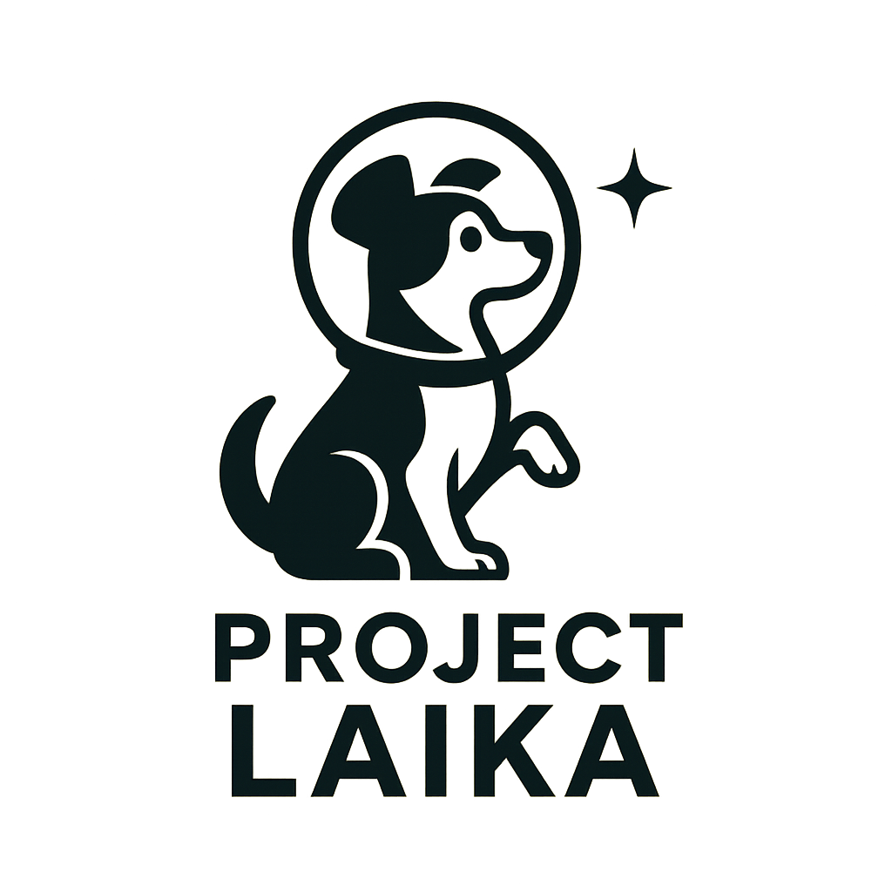

## - Light-speed AI Knowledge Adventure -

# Learning AI Kick-off Adventure

---

## 1. Introduction

In 1957, Laika became the first living being to travel into space — a journey into the unknown marked by courage, curiosity, and innovation.
Her mission symbolized the willingness to take risks, embrace uncertainty, and expand the horizons of human knowledge.
Project Laika follows that same spirit, boldly venturing into the ever-changing frontier of Artificial Intelligence. It embraces exploration, resilience, and creative discovery as core values.
This is more than a technical mission: it is a daring expedition into the future of learning, innovation, and societal impact, where each experiment opens new doors to possibility. (Fewer rockets this time. Probably fewer barking dogs, too.)

Although this journey is technical in its execution, it is philosophical in its heart.
By first building a deep, practical understanding of what AI truly is, I prepare myself to ask deeper questions about what AI should become.
The ultimate goal is not only to master tools, but to reflect critically and ethically on the role of technology in the future of humanity and the Earth.

---

## 2. Project Goals

### 2.1 Knowledge Goals – *Build deep AI understanding through hands-on practice*

Rationale: Building a strong foundational knowledge enables critical thinking, deeper exploration, and the ability to create innovative and responsible AI solutions.

Focus areas:

* **Context**: Origins, relevance, and historical development.
  *→ What are the origins, relevance, and historical milestones in AI?*
* **Concepts**: Understand the key ideas, terminology, and principles behind each AI method and technology.
  *→ What are the key concepts, terms, and principles in each AI method?*
* **Function**: Problems each concept addresses and real-life use cases.
  *→ What problems does each concept solve, and where is it applied in real life?*
* **Mechanism**: Internal workings — logic, math, structure.
  *→ How does the concept work internally — logically, mathematically, and structurally?*
* **Limitations**: Risks, weaknesses, and failure cases.
  *→ What are the risks, limitations, or potential failure scenarios?*
* **Best Practices**: How to apply effectively and avoid common mistakes.
  *→ What are best practices and common pitfalls to avoid?*
* **Case Studies**: Examples of success and failure.
  *→ What real-world cases show success or failure of this concept?*
* **Future Trends**: Emerging developments and trajectories.
  *→ What future trends or evolutions are expected for this concept?*
* **Ethics**: Bias, societal impact, and responsible AI.
  *→ What ethical issues, biases, and social impacts are involved?*

### 2.2 Technical Competence Goals – *Strengthen programming and full-stack development*

Rationale: Technical fluency empowers the ability to independently build, integrate, and optimize AI systems across diverse environments.

Focus areas:

* Master the programming language **Python** for AI development.

  Rationale: 

  * **Industry Standard** for AI and machine learning.
  * **Powerful Libraries** (e.g. TensorFlow, PyTorch, HuggingFace).
  * **Vast Community**: More tutorials, support, and collaboration.
  * **Readable Syntax**: Focus on AI, not code syntax.
  * **End-to-End Capability**: From prototype to deployment.
  * **Career Value**: Python is essential for most AI roles.
  * **Fast Prototyping**: Ideal for rapid learning.
* Learn **full-stack skills** to integrate AI into functional apps (front-end, back-end, databases).
* Develop the ability to effectively use AI tools to accelerate the development process, including AI-assisted coding, design generation, and optimization.
* Develop the ability to effectively use AI as an end-user (prompt-engineering). 

### 2.3 Application Goals – *Build real, usable AI solutions*

Rationale: Applying AI knowledge in real-world environments is essential for bridging theory and practice, developing practical expertise, and delivering tangible value.

Focus areas:

* **Deploy AI models** in production using cloud and web tools.
* **Embed AI in front-end apps** (e.g. prediction, personalization, chat).
* **Create interactive AI-powered user experiences** with automation and natural interaction.

### 2.4 Professional Goals – *Establish a credible AI profile*

Rationale: Establishing a professional presence demonstrates capability, builds trust with future collaborators or employers, and showcases readiness for real-world impact.

Focus areas:

* Build a **professional portfolio** with well-documented projects.
* Learn to **explain AI to non-tech audiences**.
* Provide **practical (prompt engineering), ethical advice** on AI use.
* Improve **English fluency** in writing, documentation, and presentation.
* Position as a **hands-on AI practitioner**.
* Position as an (in-house) Python expert.
* Optimize **project-driven development skills**, mastering the full project lifecycle:

  * **Requirement Gathering**: Understanding client needs and defining project goals.
  * **Planning and Scoping**: Breaking down work into tasks, setting deadlines, and defining deliverables.
  * **Design and Prototyping**: Creating wireframes, mockups, and design systems.
  * **Development**: Writing code for front-end, back-end, and integrations.
  * **Testing and Quality Assurance**: Checking functionality, usability, performance, and security.
  * **Deployment**: Publishing websites or applications to production environments.
  * **Maintenance and Updates**: Fixing bugs, updating content, and improving features post-launch.
  * **Project Management**: Using tools like Jira, Trello, or GitHub Projects to track progress and coordinate the team. 

    Optimizing project-driven development is a critical element of professional growth. It ensures the ability to independently manage the full lifecycle of real-world projects, from initial client consultation to final deployment and maintenance. Mastery of this cycle not only strengthens technical skills but also enhances leadership, planning, and communication abilities — key factors in establishing a strong, credible AI professional profile.

---

## 3. Project Rationale

* AI is everywhere — but only hands-on experience sets you apart (Russell & Norvig, 2021).
* Employers want **builders**, not just theorists (Russell & Norvig, 2021).
* This project aims for **deep, applied understanding** of how AI works in the real world (Goodfellow, Bengio, & Courville, 2016).
* It will result in a **clear, practical portfolio** of skills and projects.

**Sources:**

* Russell, S., & Norvig, P. (2021). *Artificial Intelligence: A Modern Approach* (4th ed.). Pearson.
* Goodfellow, I., Bengio, Y., & Courville, A. (2016). *Deep Learning*. MIT Press.

---

## 4. Structure & Approach

This project follows a **phased learning path**, inspired by AI’s historical development. Each phase produces working results with supporting documentation.

* Skills build **step-by-step**, mirroring AI’s evolution.
* Deliverables are **visible and usable**, not just theoretical.
* Combines **AI development** and **full-stack integration**.
* Reviews of technical, ethical, and professional lessons. 

---

## 5. Project Phases and Planning

| Phase | Focus                       | Deliverable                                                                                     | Planned Month(s) |
| ----- | --------------------------- | ----------------------------------------------------------------------------------------------- | ---------------- |
| 1     | Perceptron                  | Simple browser-based classifier: circle vs. square. (Because even AI needs to know its shapes.) | Month 1          |
| 2     | Feedforward Network         | Multi-class shape recognition model.                                                            | Month 2          |
| 3     | CNN                         | Image classifier (e.g. MNIST digits).                                                           | Month 3-4        |
| 4     | Full-Stack App              | Complete system: front-end + server + AI + database.                                            | Month 5          |
| 5     | Transfer Learning           | Fine-tune a pre-trained model.                                                                  | Month 6          |
| 6     | Mini-GPT/Chatbot            | Simple conversational language model. (Warning: might develop a questionable sense of humor.)   | Month 7          |
| 7     | Final Reflection and Report | Comprehensive philosophical and ethical reflection on AI based on project learnings.            | Month 8          |

*Note: Planning may be adjusted based on progress.*

## 6. Tools & Technologies

* **Front-end**: HTML, CSS, JS (optionally React or Vite).
* **Back-end**: Node.js or Python (Flask/FastAPI).
* **AI Frameworks**: TensorFlow, PyTorch, HuggingFace, TensorFlow\.js.
* **Database**: MongoDB or SQLite.
* **Deployment**: GitHub Pages, Railway, Render, or VPS.
* **Version Control**: Git and GitHub.
* **Documentation**: Markdown.

---

## 7. Success Criteria

This project also embraces a deeper ethical commitment: to explore how AI can be used in service of humanity and the planet. Beyond technical success, one of the key outcomes will be a final reflection on responsible AI — how to align technology with values such as fairness, sustainability, and well-being.

Project success = **technical delivery** + **skills growth** + **ethical insight**.

To ensure clarity and accountability, success is defined by measurable outcomes in each area.

* Functional demos at each phase, with clearly defined goals and expected results.
* Clear GitHub repos with structured documentation and README files explaining purpose, structure, and how to run the project.
* Ability to explain projects to both technical and non-technical audiences, using concise visualizations or diagrams where needed.
* Tangible skill progression in both programming and AI understanding, tracked by completing each phase with self-assessment checklists.
* A professional, presentable portfolio including deployed apps, code samples, and project write-ups suitable for job applications or freelance opportunities.

---

## 8. Risks and Mitigation

While the project is well-structured, risks are inevitable. Spoiler: things will go wrong. That’s part of the fun. Key risks and mitigation strategies include:

| Risk                 | Description                                                                         | Mitigation Strategy                                                                                  |
| -------------------- | ----------------------------------------------------------------------------------- | ---------------------------------------------------------------------------------------------------- |
| Timeline Delays      | Difficulty keeping up with the monthly schedule.                                    | Build buffer time into each phase; adjust planning if necessary.                                     |
| Technical Challenges | Encountering unexpected technical issues (e.g., deployment errors, model failures). | Seek community support, use official documentation, and maintain a flexible problem-solving mindset. |
| Motivation Loss      | Decreased enthusiasm over time, especially during complex phases.                   | Break tasks into smaller milestones and celebrate small wins to maintain momentum.                   |
| Ethical Complexity   | Facing unexpected ethical dilemmas in AI applications.                              | Conduct regular ethical reviews after each phase; consult AI ethics guidelines.                      |
| Skill Gaps           | Discovering missing knowledge or abilities mid-project.                             | Use online resources (e.g., Hugging Face, Fast.ai, TensorFlow tutorials) to quickly bridge gaps.     |

## 9. Final Motivation

Project Laika is not only a technical roadmap — it is a personal commitment to growth, exploration, and creative courage. It’s about building the future by actively engaging with the unknown, turning uncertainty into understanding, and translating ideas into action.

A key question throughout this journey will be: **Is responsible AI even possible?** Can we truly design systems that serve all of humanity and the planet — or are we always constrained by bias, profit, and the limits of technology?

Each step forward in this project is a deliberate act of learning by doing — and a leap toward becoming a creator of responsible, impactful AI.

And if nothing else: at least I'll have taught a machine how to recognize a circle. Which is a good start, depending on how you feel about circles.

(Seriousness aside: true progress begins with humble experiments and a stubborn sense of humor.)

---
